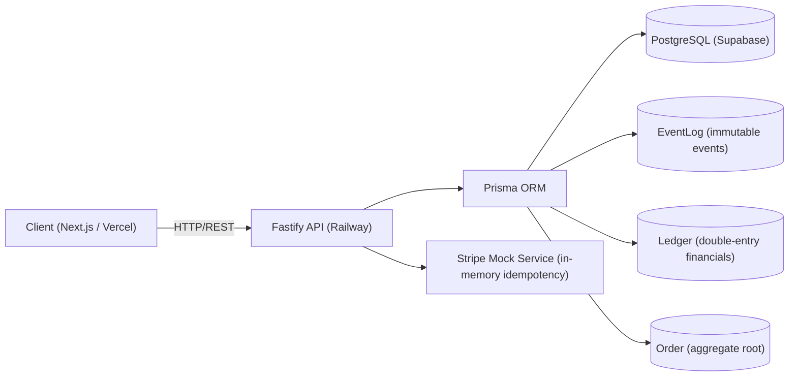
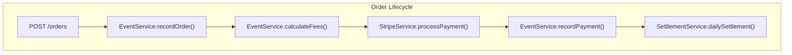
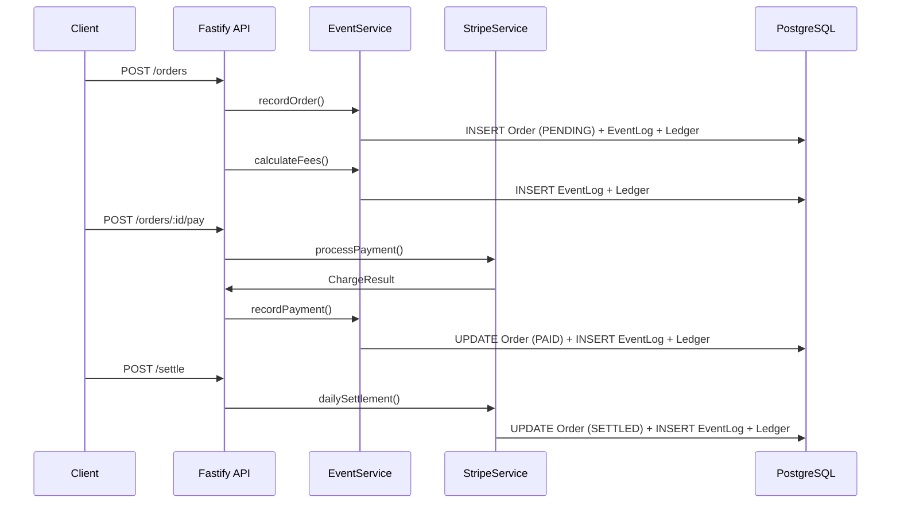

# Architecture

## Overview

Entropi is a financial order-management system that records every business event as an immutable append-only entry (EventLog) and derives financial position from a separate double-entry Ledger. The backend is a Fastify API with a PostgreSQL backing store; the frontend is Next.js 14. All monetary amounts are stored as `Decimal(18,4)` in the database, manipulated with `big.js` in application code, and transmitted as plain strings across the API boundary.

## Architecture Diagram

## Component Breakdown

| Component                | Responsibility                                                                     |
| :----------------------- | :--------------------------------------------------------------------------------- |
| `EventService`           | Orchestrates order creation, payment confirmation, and fee calculation             |
| `StripeService`          | Mock payment gateway; validates amounts, simulates latency, and guards idempotency |
| `SettlementService`      | Runs daily batch settlement per `PAID` order, idempotently                        |
| `FastifyInstance.prisma` | Singleton `PrismaClient` registered as a Fastify plugin                            |
| Routes                   | Fastify plugins for `/orders/*` and `/settle`; validates JSON schemas              |

## Ledger Design

The Ledger is an append-only journal of financial entries. Every operation that changes financial state produces at least two rows (debit + credit). The sum of all debits must equal the sum of all credits for any given order; this is enforced by the `verifyLedgerBalance` method and the `chk_ledger_debit_xor_credit` database constraint.

Example: Order for $100.0000

| Step                    | Account           | Debit     | Credit    | Description                   |
| :---------------------- | :--------------   | :------   | :------   | :---------------------------- |
| 1. Create order         | `order_balance`   | 100.0000  | —         | Order value debited to balance|
| 1. Create order         | `order_pending`   | —         | 100.0000  | Value credited as pending     |
| 2. Process payment      | `payment_received`| 100.0000  | —         | Payment received from customer|
| 2. Process payment      | `order_balance`   | —         | 100.0000  | Balance cleared               |
| 3. Calculate fees       | `fees_owed`       | 3.0000    | —         | 3% fee calculated             |
| 3. Calculate fees       | `payment_received`| —         | 3.0000    | Fee deducted from payment     |
| 4. Daily settlement     | `seller_payout`   | 97.0000   | —         | Net payout to seller          |
| 4. Daily settlement     | `payment_received`| —         | 97.0000   | Payment ledger cleared        |

Total debits = 100 + 100 + 3 + 97 = 300.0000
Total credits = 100 + 100 + 3 + 97 = 300.0000

## Key Design Decisions

1. **Decimal(18,4)**
   - **Decision**: Store all monetary values as `Decimal(18,4)` in PostgreSQL.
   - **Alternative**: Float / Double.
   - **Why chosen**: Float introduces rounding errors in financial math. `Decimal(18,4)` gives us 18 digits of precision (enough for $99 trillion+) with 4 decimal places for sub-cent precision required by fee calculations.

2. **Separate Ledger table**
   - **Decision**: Maintain a distinct `Ledger` table alongside `EventLog`.
   - **Alternative**: Derive financial state directly from `EventLog`.
   - **Why chosen**: The `Ledger` is a single, independently queryable source of truth for reconciliation. `EventLog` is the domain audit history; `Ledger` is the financial position. Separation allows reconciliation to run independently of event replay.

3. **idempotencyKey (UUID)**
   - **Decision**: Generate UUID `idempotencyKey` client-side and enforce uniqueness at the database level.
   - **Alternative**: Application-level deduplication with in-memory caches.
   - **Why chosen**: Network retries must not double-charge. A database-level `UNIQUE` constraint on `idempotencyKey` is the only way to guarantee no duplicates under race conditions.

4. **version as integer**
   - **Decision**: Attach an auto-incrementing integer `version` to every `Order`.
   - **Alternative**: Timestamp-based versioning or no versioning.
   - **Why chosen**: Enables optimistic concurrency control (UPDATE WHERE version = expected), guarantees strict per-aggregate event ordering, and allows cheap event replay via `ORDER BY version`.

5. **Append-only EventLog + Ledger**
   - **Decision**: Never update or delete a row in `EventLog` or `Ledger`.
   - **Alternative**: Mutable state tables.
   - **Why chosen**: Audit compliance; a full replay of any order's state is possible at any time. There is no mutable state to corrupt, and time-travel queries are supported by simply reading events up to a certain version.

6. **Fastify over Express**
   - **Decision**: Use Fastify 4.x as the HTTP framework.
   - **Alternative**: Express.js.
   - **Why chosen**: Lower overhead for high-throughput financial APIs, native TypeScript support, and built-in JSON schema validation that reduces boilerplate.

7. **big.js over Decimal.js**
   - **Decision**: Use `big.js` for all monetary math in JavaScript.
   - **Alternative**: `decimal.js`, native `BigInt`.
   - **Why chosen**: Smaller bundle size, sufficient precision for our 4-decimal-place requirements, and a familiar, chainable API.

## Data Flow: Order Lifecycle

